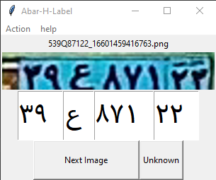

# Abar H Label
Labeling the photo of the license plate based on the name of the license plate itself

## Folder Structure
There should be **3** folders next to the program.
- The main folder of labels is called `images`.
- The modified photos folder is called `output_dir`.
- Unknown fold labels are called `unknown`.
The labels whose values are reviewed and recorded are stored in the output_dir folder.
Labels whose values are unrecognizable are put in the unknown folder.

## Label Structure
Labels that this software processes must be stored with a naming structure:
- Pattern: `123..C12345_DatetimeToStr.Format`.
- Sample: `319Q87131_16601459966049.png`.
The characters after _ are removed and the characters before it are the same as the license plate number.

These are changed based on a certain format and finally become in a format like this:
- Pattern: `12_C_123_45_Gregorian seconds.Format`.
- Sample: `39_Q_871_23_1719648615.5914452.png`.

## Supported characters
```python
characters = {
    "A" : "الف",
    "B" : "ب",
    "C" : "ج",
    "D" : "ل",
    "E" : "م",
    "F" : "ن",
    "G" : "ق",
    "H" : "و",
    "I" : "ه",
    "J" : "ی",
    "K" : "د",
    "L" : "س",
    "M" : "ص",
    "N" : "معلول",
    "N" : "ژ",
    "O" : "ت",
    "P" : "ط",
    "Q" : "ع",
    "R" : "D",
    "S" : "S",
    "T" : "پ",
    "U" : "تشریفات",
    "V" : "ث",
    "W" : "ز",
    "X" : "ش",
    "Y" : "ف",
    "Z" : "ک",
    "_" : "گ"
}
```

 

## Operating system executable output
### Linux

This guide demonstrates how to convert your Python script into a standalone executable format for Linux using cx_Freeze.

#### Installation
You can install cx_Freeze using pip:
```
pip install cx_Freeze
```
#### Usage
Create a `setup.py` script in your project directory:

```python
from cx_Freeze import setup, Executable
setup(
    name="your_script",
    version="0.1",
    description="Description of your script",
    executables=[Executable("your_script.py")]
)
```
Replace "main.py" with the name of your script and "main.py" with the filename.
Run the following command in the terminal to build the executable:
```
python setup.py build
```
After executing these steps, your Linux executable will be generated and ready for use.

### Windows


This guide demonstrates how to convert your Python script into a standalone executable format for Windows using auto-py-to-exe.

#### Installation
You can install auto-py-to-exe using pip:

```
pip install auto-py-to-exe
```
#### Usage
1. Open the terminal and run the following command:
```
auto-py-to-exe
```
2. This will launch the auto-py-to-exe graphical user interface (GUI).
3. Click on "Select Script" and choose your Python script file.
4. Customize the settings as needed (e.g., output directory, one-file mode).
5. Click on "Convert .py to .exe".
6. Once the conversion is complete, you will find the Windows executable file in the specified output directory.
7. You can now distribute the executable file to users who can run your code without needing Python or any dependencies.
